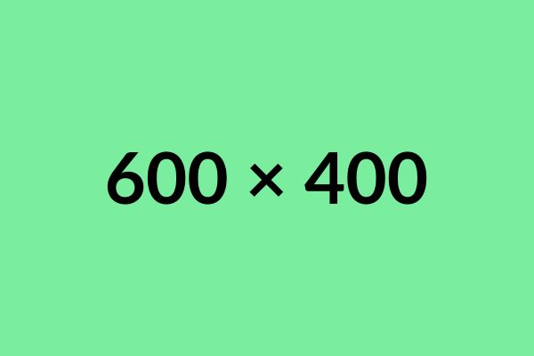

# Gallery Pop - A Simple and Interactive Image/Video Gallery

Gallery Pop is a lightweight, easy-to-implement JavaScript library that allows you to create a pop-up gallery for images and videos. It includes features such as navigation between images, close functionality, and media grouping.

---

## Table of Contents

1. [Overview](#1-overview)
2. [Features](#2-features)
3. [Installation](#3-installation)
4. [HTML Structure](#4-html-structure)
5. [Customization](#5-customization)
6. [Preview](#Preview)
7. [License](#license)
8. [Credits](#credits)

---

## 1. Overview

Gallery Pop is a **JavaScript library** designed to provide a seamless and interactive gallery experience. It supports both images and videos, providing functionality for viewing content in a pop-up modal with next/previous navigation, thumbnails, and a counter for media items.

---

## 2. Features

- **Supports Images and Videos**: Easily display both images and videos within the same gallery.
- **Navigation**: Navigate through media items using previous/next buttons or clickable thumbnails.
- **Media Grouping**: Media items are grouped based on the `data-group` attribute for smoother navigation.
- **Responsive Design**: Fully responsive, adapting to different screen sizes and devices.
- **Close Functionality**: Close the gallery by clicking outside the modal or pressing the "Escape" key.
- **Counter**: Displays the current image/video index and total items in the gallery.

---

## 3. Installation

To get started with Gallery Pop, follow the installation steps below:

1. **Download the Library**: 
    - Clone or download the repository from GitHub.
2. **Link the Files**:
    - Link the `gallery-pop.min.js` script and the necessary CSS in your HTML.
    - Ensure the path to the images or videos in the gallery is correct.

---

## 4. HTML Structure

Below is the structure for the HTML. It consists of several media items with the `data-gallerypop` and `data-group` attributes for grouping.

    

        

            
        

        

            
        

        

            
        

        

            
        

        

            
        

        

            
        

        

            
        

        

            
        

        

            
        

        

            
        

        

            
        

        

            
        

    

    

---

## 5. Customization
You can customize the Gallery Pop library to suit your design needs.

---

## 6. Preview

[Gallery Pop](https://gallery-pop.netlify.app/)

---

## 7. License

This project is licensed under the MIT License. You can freely use and modify it for personal or commercial purposes, as long as you provide credit to the original author.

---

## 8. Credits

#### Author : DoomAccount (Mostafa Sabry)
#### License: MIT License
#### Repository: [GitHub - Gallery Pop](https://github.com/DoomAccount/gallery-pop)
